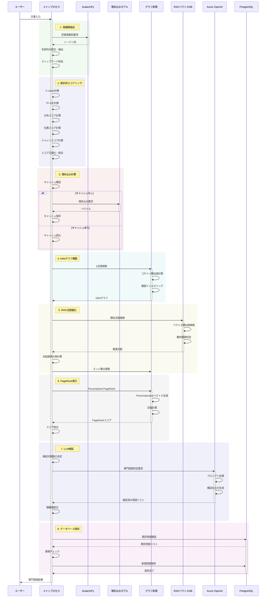
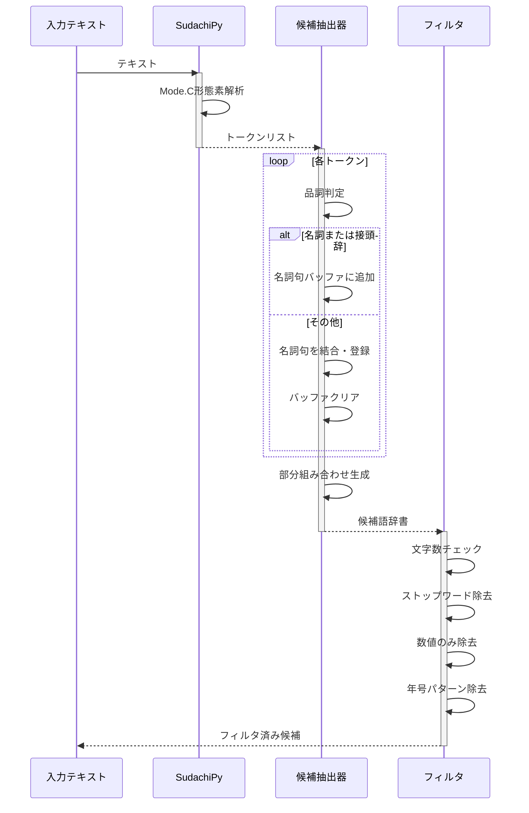
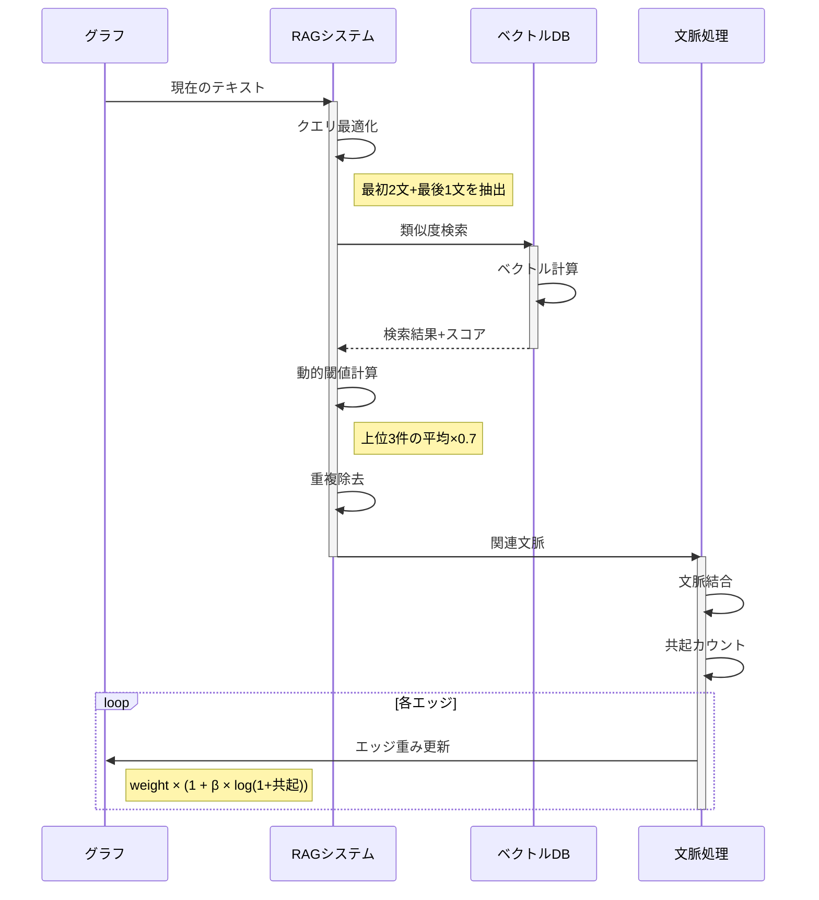
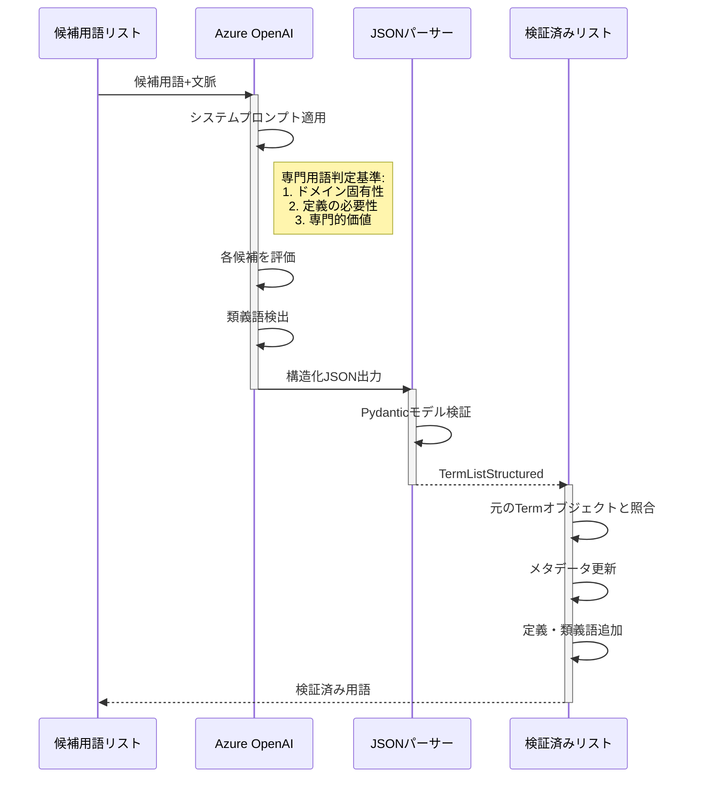
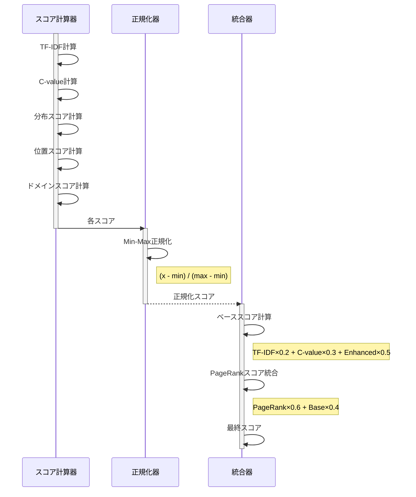
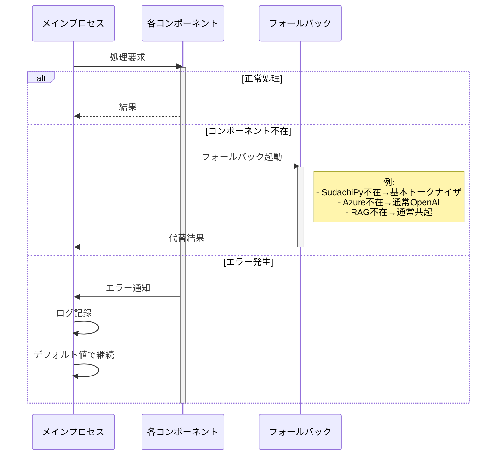
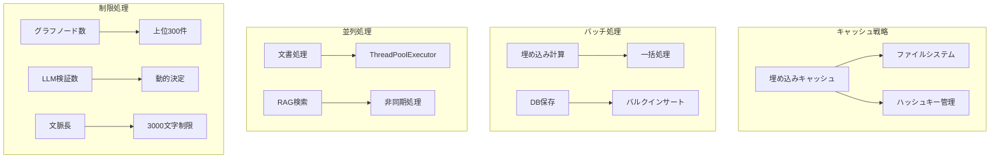

# 専門用語抽出システム V3 - シーケンス図

## 全体処理フロー

```mermaid
sequenceDiagram
    participant User as ユーザー
    participant Main as メインプロセス
    participant Sudachi as SudachiPy
    participant Embedder as 埋め込みモデル
    participant Graph as グラフ処理
    participant RAG as RAGベクトルDB
    participant LLM as Azure OpenAI
    participant DB as PostgreSQL

    User->>Main: 文書入力
    activate Main

    %% 1. 候補語抽出フェーズ
    rect rgb(240, 250, 240)
        note right of Main: 1. 候補語抽出
        Main->>Sudachi: 形態素解析要求
        activate Sudachi
        Sudachi-->>Main: トークン列
        deactivate Sudachi
        Main->>Main: 名詞句の結合・抽出
        Main->>Main: ストップワード除去
    end

    %% 2. スコアリングフェーズ
    rect rgb(240, 240, 250)
        note right of Main: 2. 統計的スコアリング
        Main->>Main: C-value計算
        Main->>Main: TF-IDF計算
        Main->>Main: 分布スコア計算
        Main->>Main: 位置スコア計算
        Main->>Main: ドメインスコア計算
        Main->>Main: スコア正規化・統合
    end

    %% 3. 埋め込み計算フェーズ
    rect rgb(250, 240, 240)
        note right of Main: 3. 埋め込み計算
        Main->>Main: キャッシュ確認
        alt キャッシュなし
            Main->>Embedder: 埋め込み要求
            activate Embedder
            Embedder-->>Main: ベクトル
            deactivate Embedder
            Main->>Main: キャッシュ保存
        else キャッシュあり
            Main->>Main: キャッシュ読込
        end
    end

    %% 4. グラフ構築フェーズ
    rect rgb(240, 250, 250)
        note right of Main: 4. kNNグラフ構築
        Main->>Graph: k近傍探索
        activate Graph
        Graph->>Graph: コサイン類似度計算
        Graph->>Graph: 閾値フィルタリング
        Graph-->>Main: kNNグラフ
        deactivate Graph
    end

    %% 5. RAG強化フェーズ
    rect rgb(250, 250, 240)
        note right of Main: 5. RAG文脈強化
        Main->>RAG: 類似文脈検索
        activate RAG
        RAG->>RAG: ベクトル類似度検索
        RAG->>RAG: 動的閾値判定
        RAG-->>Main: 関連文脈
        deactivate RAG
        Main->>Main: 共起関係の再計算
        Main->>Graph: エッジ重み更新
    end

    %% 6. PageRankフェーズ
    rect rgb(245, 245, 245)
        note right of Main: 6. PageRank実行
        Main->>Graph: Personalized PageRank
        activate Graph
        Graph->>Graph: Personalizationベクトル生成
        Graph->>Graph: 反復計算
        Graph-->>Main: PageRankスコア
        deactivate Graph
        Main->>Main: スコア統合
    end

    %% 7. LLM検証フェーズ
    rect rgb(240, 240, 250)
        note right of Main: 7. LLM検証
        Main->>Main: 検証対象数の決定
        Main->>LLM: 専門用語判定要求
        activate LLM
        LLM->>LLM: プロンプト処理
        LLM->>LLM: 構造化出力生成
        LLM-->>Main: 検証済み用語リスト
        deactivate LLM
        Main->>Main: 類義語統合
    end

    %% 8. DB保存フェーズ
    rect rgb(250, 240, 250)
        note right of Main: 8. データベース保存
        Main->>DB: 既存用語確認
        activate DB
        DB-->>Main: 既存用語リスト
        Main->>Main: 重複チェック
        Main->>DB: 新規用語保存
        DB-->>Main: 保存完了
        deactivate DB
    end

    Main-->>User: 専門用語辞書
    deactivate Main
```

## 詳細処理フロー

### 1. 候補語抽出の詳細

```mermaid
sequenceDiagram
    participant Text as 入力テキスト
    participant Tokenizer as SudachiPy
    participant Extractor as 候補抽出器
    participant Filter as フィルタ

    Text->>Tokenizer: テキスト
    activate Tokenizer
    Tokenizer->>Tokenizer: Mode.C形態素解析
    Tokenizer-->>Extractor: トークンリスト
    deactivate Tokenizer

    activate Extractor
    loop 各トークン
        Extractor->>Extractor: 品詞判定
        alt 名詞または接頭辞
            Extractor->>Extractor: 名詞句バッファに追加
        else その他
            Extractor->>Extractor: 名詞句を結合・登録
            Extractor->>Extractor: バッファクリア
        end
    end

    Extractor->>Extractor: 部分組み合わせ生成
    Extractor-->>Filter: 候補語辞書
    deactivate Extractor

    activate Filter
    Filter->>Filter: 文字数チェック
    Filter->>Filter: ストップワード除去
    Filter->>Filter: 数値のみ除去
    Filter->>Filter: 年号パターン除去
    Filter-->>Text: フィルタ済み候補
    deactivate Filter
```

### 2. RAG文脈強化の詳細

```mermaid
sequenceDiagram
    participant Graph as グラフ
    participant RAG as RAGシステム
    participant Vector as ベクトルDB
    participant Context as 文脈処理

    Graph->>RAG: 現在のテキスト
    activate RAG

    RAG->>RAG: クエリ最適化
    note right of RAG: 最初2文+最後1文を抽出

    RAG->>Vector: 類似度検索
    activate Vector
    Vector->>Vector: ベクトル計算
    Vector-->>RAG: 検索結果+スコア
    deactivate Vector

    RAG->>RAG: 動的閾値計算
    note right of RAG: 上位3件の平均×0.7

    RAG->>RAG: 重複除去
    RAG->>Context: 関連文脈
    deactivate RAG

    activate Context
    Context->>Context: 文脈結合
    Context->>Context: 共起カウント

    loop 各エッジ
        Context->>Graph: エッジ重み更新
        note right of Graph: weight × (1 + β × log(1+共起))
    end
    deactivate Context
```

### 3. Azure OpenAI検証の詳細

```mermaid
sequenceDiagram
    participant Terms as 候補用語リスト
    participant LLM as Azure OpenAI
    participant Parser as JSONパーサー
    participant Result as 検証済みリスト

    Terms->>LLM: 候補用語+文脈
    activate LLM

    LLM->>LLM: システムプロンプト適用
    note right of LLM: 専門用語判定基準:<br/>1. ドメイン固有性<br/>2. 定義の必要性<br/>3. 専門的価値

    LLM->>LLM: 各候補を評価
    LLM->>LLM: 類義語検出
    LLM->>Parser: 構造化JSON出力
    deactivate LLM

    activate Parser
    Parser->>Parser: Pydanticモデル検証
    Parser-->>Result: TermListStructured
    deactivate Parser

    activate Result
    Result->>Result: 元のTermオブジェクトと照合
    Result->>Result: メタデータ更新
    Result->>Result: 定義・類義語追加
    Result-->>Terms: 検証済み用語
    deactivate Result
```

### 4. スコア統合の詳細

```mermaid
sequenceDiagram
    participant Scorer as スコア計算器
    participant Norm as 正規化器
    participant Fusion as 統合器

    activate Scorer
    Scorer->>Scorer: TF-IDF計算
    Scorer->>Scorer: C-value計算
    Scorer->>Scorer: 分布スコア計算
    Scorer->>Scorer: 位置スコア計算
    Scorer->>Scorer: ドメインスコア計算
    Scorer->>Norm: 各スコア
    deactivate Scorer

    activate Norm
    Norm->>Norm: Min-Max正規化
    note right of Norm: (x - min) / (max - min)
    Norm-->>Fusion: 正規化スコア
    deactivate Norm

    activate Fusion
    Fusion->>Fusion: ベーススコア計算
    note right of Fusion: TF-IDF×0.2 + C-value×0.3 + Enhanced×0.5

    Fusion->>Fusion: PageRankスコア統合
    note right of Fusion: PageRank×0.6 + Base×0.4

    Fusion->>Fusion: 最終スコア
    deactivate Fusion
```

## エラーハンドリング

```mermaid
sequenceDiagram
    participant Main as メインプロセス
    participant Component as 各コンポーネント
    participant Fallback as フォールバック

    Main->>Component: 処理要求
    activate Component

    alt 正常処理
        Component-->>Main: 結果
    else コンポーネント不在
        Component->>Fallback: フォールバック起動
        activate Fallback
        note right of Fallback: 例:<br/>- SudachiPy不在→基本トークナイザ<br/>- Azure不在→通常OpenAI<br/>- RAG不在→通常共起
        Fallback-->>Main: 代替結果
        deactivate Fallback
    else エラー発生
        Component->>Main: エラー通知
        Main->>Main: ログ記録
        Main->>Main: デフォルト値で継続
    end

    deactivate Component
```

## パフォーマンス最適化

```mermaid
graph TB
    subgraph キャッシュ戦略
        A[埋め込みキャッシュ] --> B[ファイルシステム]
        A --> C[ハッシュキー管理]
    end

    subgraph バッチ処理
        D[埋め込み計算] --> E[一括処理]
        F[DB保存] --> G[バルクインサート]
    end

    subgraph 並列処理
        H[文書処理] --> I[ThreadPoolExecutor]
        J[RAG検索] --> K[非同期処理]
    end

    subgraph 制限処理
        L[グラフノード数] --> M[上位300件]
        N[LLM検証数] --> O[動的決定]
        P[文脈長] --> Q[3000文字制限]
    end
```