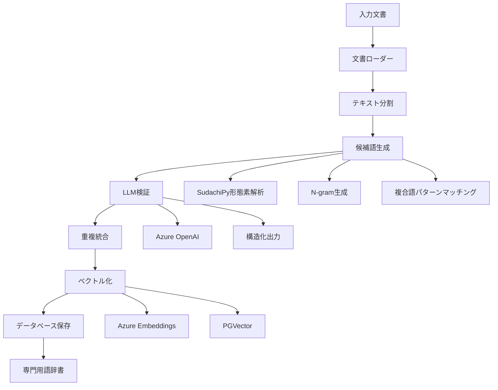

# 専門用語抽出ロジック詳細仕様書

## 概要
本システムは、技術文書から専門用語とその類義語を自動抽出し、RAG（Retrieval-Augmented Generation）システムで活用可能な辞書を構築します。SudachiPyによる高精度な形態素解析とAzure OpenAI APIを組み合わせた2段階処理により、高品質な専門用語辞書を生成します。

## システムアーキテクチャ



## 処理フロー

### 1. 文書の読み込みと前処理

#### 対応ファイル形式
- PDF (`.pdf`) - PyPDFLoader
- Word文書 (`.docx`, `.doc`) - Docx2txtLoader  
- テキストファイル (`.txt`) - TextLoader
- Markdown (`.md`) - UnstructuredFileLoader
- HTML (`.html`, `.htm`) - UnstructuredFileLoader

#### テキスト分割設定
```python
RecursiveCharacterTextSplitter(
    chunk_size=2000,        # チャンクサイズ
    chunk_overlap=200,      # オーバーラップ
    keep_separator=True,    # 区切り文字を保持
    separators=["\n\n", "。", "\n", " "]  # 優先順位付き区切り文字
)
```

### 2. 候補語生成（SudachiPy処理）

#### 2.1 形態素解析
```python
# SudachiPy Mode.A（最短単位）で分かち書き
tokenizer = dictionary.Dictionary().create()
tokens = tokenizer.tokenize(text, mode=tokenizer.Tokenizer.SplitMode.A)
```

#### 2.2 品詞情報の詳細抽出
各トークンから以下の情報を取得：
- `surface`: 表層形
- `normalized`: 正規化形
- `pos`: 品詞大分類
- `pos_detail`: 品詞細分類（サ変可能、普通名詞、固有名詞など）
- `position`: トークン位置

#### 2.3 名詞抽出ルール
- 品詞が「名詞」のトークンを抽出
- 1文字の名詞は除外（ノイズ削減）
- 正規化形を使用して表記揺れを統一

### 3. C値・NC値アルゴリズム（未実装・別ファイルで提供）

現在の`term_extractor_embeding.py`ではC値・NC値は実装されていませんが、`term_extractor_with_c_value.py`で実装を提供しています。

#### C値（C-value）アルゴリズム
複合語の専門用語らしさを測る統計的指標：

```
C-value(a) = log₂|a| × (freq(a) - (1/|Ta|) × Σb∈Ta freq(b))
```

- `|a|`: 候補語aの長さ（単語数）
- `freq(a)`: 候補語aの出現頻度
- `Ta`: aを部分文字列として含むより長い候補語の集合
- `freq(b)`: より長い候補語bの出現頻度

**特徴**：
- 長い複合語を優先（log₂|a|の項）
- 独立して出現する用語を評価（他の用語の一部としてのみ出現する場合はスコアが下がる）

#### NC値（NC-value）アルゴリズム
C値に文脈情報を加えた改良版：

```
NC-value(a) = 0.8 × C-value(a) + 0.2 × Context(a)
Context(a) = Σw∈Ca freq(w)
```

- `Ca`: 候補語aと共起する文脈語の集合
- `freq(w)`: 文脈語wの頻度

**文脈語の条件**：
- 候補語の直前・直後に出現
- 名詞、動詞、形容詞のみ対象

### 4. 複合語生成ロジック（現在の実装）

#### 4.1 連続性判定
名詞が連続しているかを位置情報で判定：
```python
if token['position'] == prev_token['position'] + 1:
    # 連続している
```

#### 3.2 品詞パターンによる結合判定

| 前の名詞の品詞細分類 | 次の名詞の品詞細分類 | 結合判定 |
|-------------------|-------------------|---------|
| サ変可能 | サ変可能 | 結合する |
| 普通名詞/固有名詞 | 普通名詞/固有名詞/サ変可能 | 結合する |
| その他の名詞 | その他の名詞 | 結合する（デフォルト） |

#### 3.3 複合語パターンマッチング
専門分野でよく使われる複合語パターンを定義：

```python
compound_patterns = {
    "医薬": ["品", "部外品"],
    "製造": ["管理", "業者", "所", "販売", "工程"],
    "品質": ["管理", "保証", "システム"],
    "生物": ["由来", "学的"],
    "構造": ["設備"],
    "試験": ["検査"],
    "安定性": ["モニタリング"],
}
```

パターンにマッチした場合は優先的に結合して複合語を生成。

#### 3.4 N-gram生成
- 最小: 2-gram
- 最大: 6-gram
- 制約: 12文字以内の複合語のみ採用

### 5. LLMによる検証と定義生成

#### 5.1 プロンプト設計
```python
validation_prompt = """
あなたは専門用語抽出の専門家です。
以下のテキストと候補リストから、重要な専門用語を抽出してください。

選定基準:
1. 専門性が高く、その分野特有の概念を表す用語
2. 文書内で重要な意味を持つ用語
3. 一般的すぎる用語は除外
4. 略語の場合は正式名称も含める

## テキスト本文:
{text}

## 候補リスト:
{candidates}

JSON形式で返してください。
"""
```

#### 5.2 構造化出力（Pydantic Model）
```python
class Term(BaseModel):
    headword: str           # 専門用語の見出し語
    synonyms: List[str]     # 類義語・別名のリスト
    definition: str         # 30-50字程度の簡潔な定義
    category: Optional[str] # カテゴリ名

class TermList(BaseModel):
    terms: List[Term]       # 専門用語のリスト
```

### 6. 重複統合処理

#### 6.1 重複判定
- 見出し語を小文字化して比較
- 同じ意味の用語は1つにまとめる

#### 6.2 情報のマージ
- 類義語リストを統合（重複を除去）
- 定義が空の場合は他の定義で補完
- カテゴリ情報も統合

### 7. ベクトル化とRAG統合

#### 7.1 埋め込みベクトル生成
```python
embeddings = AzureOpenAIEmbeddings(
    azure_deployment="text-embedding-3-small"
)
```

#### 7.2 PGVectorへの保存
- PostgreSQLのベクトルデータベース拡張を使用
- コサイン類似度による検索が可能
- メタデータ（定義、類義語、カテゴリ）も保存

#### 7.3 類似検索の活用
```python
async def search_similar_terms(query: str, k: int = 5):
    """クエリに類似した専門用語を検索"""
    results = await vector_store.similarity_search(
        query=query,
        k=k,
        filter={"category": "技術用語"}
    )
    return results
```

### 8. データベーススキーマ

#### jargon_dictionary テーブル
```sql
CREATE TABLE jargon_dictionary (
    id SERIAL PRIMARY KEY,
    headword TEXT NOT NULL UNIQUE,
    synonyms TEXT[],
    definition TEXT,
    category TEXT,
    embedding VECTOR(1536),
    metadata JSONB,
    created_at TIMESTAMP DEFAULT CURRENT_TIMESTAMP,
    updated_at TIMESTAMP DEFAULT CURRENT_TIMESTAMP
);

CREATE INDEX idx_jargon_headword ON jargon_dictionary(headword);
CREATE INDEX idx_jargon_category ON jargon_dictionary(category);
CREATE INDEX idx_jargon_embedding ON jargon_dictionary USING ivfflat (embedding vector_cosine_ops);
```

## パフォーマンス最適化

### 1. バッチ処理
- チャンク処理: 3件ずつバッチ処理
- API呼び出し間隔: 7秒のディレイ（レート制限対応）

### 2. 並列処理
```python
async def extract_terms_with_rate_limit(chunks: List[str]):
    batch_size = 3
    delay_between_batches = 7
    
    results = []
    for i in range(0, len(chunks), batch_size):
        batch = chunks[i:i+batch_size]
        batch_results = await asyncio.gather(
            *(term_extraction_chain.ainvoke(chunk) for chunk in batch)
        )
        results.extend(batch_results)
        
        if i + batch_size < len(chunks):
            await asyncio.sleep(delay_between_batches)
```

### 3. キャッシュ戦略
- LangChain のキャッシュ機能を活用
- 同一文書の再処理を回避

## エラーハンドリング

### 1. API接続エラー
```python
try:
    result = await llm.ainvoke(prompt)
except Exception as e:
    logger.error(f"API Error: {e}")
    # リトライロジック
```

### 2. 形態素解析エラー
```python
try:
    tokens = tokenizer.tokenize(text)
except Exception as e:
    logger.error(f"Tokenization Error: {e}")
    return []  # 空のリストを返す
```

### 3. データベース接続エラー
- 接続プールの使用
- トランザクション管理
- デッドロック回避

## 品質評価指標

### 1. 抽出精度
- 適合率（Precision）: 抽出された用語のうち正しい専門用語の割合
- 再現率（Recall）: 文書内の専門用語のうち抽出できた割合
- F1スコア: 適合率と再現率の調和平均

### 2. 処理速度
- 文書あたりの処理時間
- API呼び出し回数
- データベース書き込み速度

### 3. コスト最適化
- トークン使用量の監視
- 候補語の事前フィルタリング（上位100件に制限）
- チャンクサイズの最適化

## 今後の拡張可能性

### 1. 多言語対応
- 英語専門用語の抽出
- 多言語辞書の構築

### 2. ドメイン特化
- 分野別の複合語パターン定義
- 業界特有の略語辞書

### 3. 学習機能
- ユーザーフィードバックによる精度向上
- 抽出パターンの自動学習

### 4. 視覚化
- 専門用語の関係性グラフ
- 出現頻度ヒートマップ
- 時系列での用語トレンド分析

## 使用例

### コマンドライン実行
```bash
python scripts/term_extractor_embeding.py ./input ./output/dictionary.json
```

### Python API
```python
from term_extractor import extract_terms

# 単一ファイルから抽出
terms = await extract_terms("document.pdf")

# 複数ファイルから抽出
terms = await extract_terms_from_directory("./documents/")

# RAGシステムとの統合
rag_system.update_jargon_dictionary(terms)
```

## トラブルシューティング

### よくある問題と解決方法

1. **「Connection error」エラー**
   - Azure OpenAI APIキーを確認
   - エンドポイントURLを確認
   - ネットワーク接続を確認

2. **「No terms extracted」警告**
   - 入力文書の言語を確認（日本語対応）
   - チャンクサイズを調整
   - 形態素解析の動作確認

3. **処理が遅い**
   - バッチサイズを調整
   - API呼び出し間隔を最適化
   - 並列処理数を増やす

4. **メモリ不足**
   - チャンクサイズを小さくする
   - バッチ処理のサイズを減らす
   - 大規模文書を分割処理

## まとめ

本システムは、最新の自然言語処理技術を組み合わせて、高精度な専門用語抽出を実現しています。SudachiPyによる日本語解析の精度とAzure OpenAIの文脈理解能力を融合することで、実用的な専門用語辞書の自動構築が可能となっています。